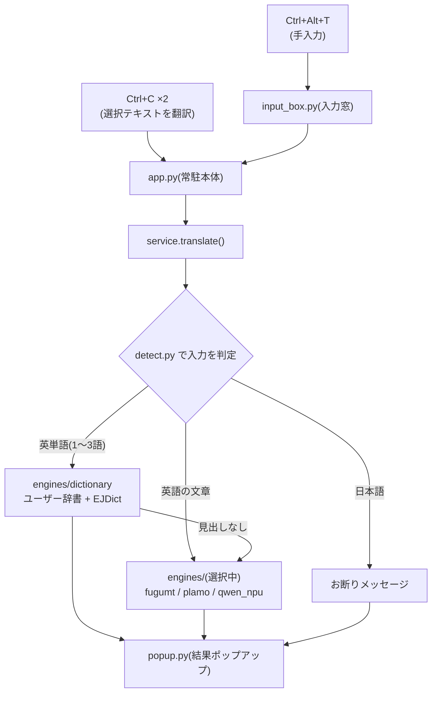

# translator 仕様書

コードの構造と、カスタマイズする際にどこを触ればよいかをまとめる。
利用者向けの導入手順は [README.md](README.md) を参照。

## 1. 全体像



- 常駐プロセスは1つ(多重起動はミューテックスで防止)
- モデルは初回利用時に遅延ロードされ、以後プロセス内に保持される
- 翻訳処理で外部通信は一切しない

## 2. モジュール構成

| ファイル | 責務 |
|---|---|
| `app.py` | 常駐本体。トレイ、ホットキー登録、翻訳フローの束ね |
| `service.py` | 入力テキスト → エンジン選択 → 結果、のルーティング |
| `detect.py` | 単語/文章/日本語の判定ロジック |
| `clipboard.py` | 選択テキストの取得(クリップボード退避・復元含む) |
| `popup.py` | 結果ポップアップ(位置決め・Esc/クリック消去) |
| `input_box.py` | 手入力翻訳の小窓(フォアグラウンド奪取対応) |
| `hotkeys.py` | RegisterHotKey バックエンド(none モード。フックを張らない) |
| `config.py` | config.toml の読み込みとデフォルト値 |
| `paths.py` | 全ファイルパスの定義(モデル・辞書・設定) |
| `engines/base.py` | エンジンの抽象基底(`Engine`)と `EngineNotReady` |
| `engines/__init__.py` | エンジンのレジストリ(名前→インスタンス、遅延生成) |
| `engines/dictionary.py` | EJDict(SQLite)+ ユーザー辞書 |
| `engines/fugumt.py` | FuguMT / CTranslate2(CPU) |
| `engines/plamo.py` | PLaMo翻訳 / llama-server 子プロセス管理(CPU) |
| `engines/qwen_npu.py` | Qwen3-4B / OpenVINO(GPU→NPU→CPU フォールバック) |
| `setup_cli.py` | 辞書・モデルのダウンロードと変換 |
| `startup_cli.py` | スタートアップ登録 / コンソールなし起動 |
| `bench.py` | エンジン比較ベンチマーク |
| `cli.py` | ワンショット翻訳(デバッグ用。モデルを毎回ロードするので遅い) |

## 3. ユーザーがいじることを想定した部分

### 3.1 config.toml(再起動で反映)

| セクション | キー | 既定値 | 意味 |
|---|---|---|---|
| hotkey | mode | "global" | "global"=フック(2連打可・EDR検知有) / "none"=RegisterHotKey(フックなし・EDR安全)。→ §8 |
| hotkey | combo | "double-ctrl-c" | 選択翻訳のトリガー。keyboard書式("f9"等)にも変更可 |
| hotkey | double_press_ms | 500 | 2連打の判定間隔(global のみ) |
| hotkey | input_combo | "ctrl+alt+t" | 入力窓のホットキー。"" で無効化 |
| engine | sentence | "fugumt" | 文章エンジン: fugumt / plamo / qwen_npu |
| popup | timeout_ms | 300000 | 自動クローズまでの時間(Esc/クリック消去の保険) |
| popup | font_family / font_size | Yu Gothic UI / 11 | ポップアップの書体 |
| popup | max_width | 480 | ポップアップの折返し幅(px) |
| plamo | port | 8765 | llama-server のポート |
| plamo | n_gpu_layers | 0 | **0のまま推奨**(→ §5 の落とし穴) |
| plamo | ctx_size | 4096 | コンテキスト長 |
| plamo | preload | false | 起動時にサーバーも起動(メモリ常時 ~6GB) |
| qwen | devices | ["GPU","NPU","CPU"] | ロードを試す順。NPUは遅いがCPU/GPU非占有 |
| qwen | max_new_tokens | 512 | 生成上限 |
| qwen | preload | false | 起動時にロードしておく |

### 3.2 ユーザー辞書 `data/user_dict.txt`(保存で即反映)

- `見出し<TAB>意味`、1行1義。`#` はコメント
- 自分の訳が先頭に出て、EJDict の訳も併記される
- 同じ見出しを複数行書けば全部表示(略語の複数義)
- 語形変化(PCs→pc 等)は自動で剥がして引かれる

### 3.3 判定ロジック `detect.py`

- `is_dictionary_candidate`: 辞書引きに回す条件。既定「英字のみ1〜3語」。
  4語の熟語も辞書に回したい等はここの `<= 3` を変える
- `is_japanese`: 日本語判定の閾値(既定: 日本語文字が30%以上)

### 3.4 ポップアップの見た目 `popup.py`

冒頭の `BG / FG / ACCENT / SUB` が配色(ダークテーマ)。入力窓も同じ定数を使う。

### 3.5 ベンチの試験文 `bench.py`

`TEST_SENTENCES` を差し替えれば自分の業務ドメインの文で比較できる。
結果は `bench_results.md` に出力。

### 3.6 モデルの差し替え `setup_cli.py`

- `PLAMO_QUANT`(既定 "Q4_K_S"): 量子化を変える場合(Q8_0 は約10GB・高品質・低速)
- `QWEN_REPO`: 変換元モデル。Qwen以外にする場合は `engines/qwen_npu.py` の
  ChatML テンプレートも要確認
- `EJDICT_SRC_URL`: 辞書データの取得元

### 3.7 エンジンの追加手順

1. `engines/` に `Engine` を継承したクラスを書く(`translate` / `is_ready` /
   任意で `warmup`)。重いロードは初回 `translate` まで遅延させる
2. `engines/__init__.py` の `get_engine` に分岐を追加、`SENTENCE_ENGINES` に名前を追加
3. `app.py` のトレイメニューの表示名 dict に1行追加
4. 必要なら `setup_cli.py` にダウンロード処理と `TARGETS` 登録を追加

## 4. スレッドモデル(改造時の最重要注意)

| スレッド | 担当 |
|---|---|
| メインスレッド | tkinter(ポップアップ・入力窓の生成/破棄はここだけ) |
| keyboard フック | ホットキーコールバック |
| mouse フック | クリック消去の検知 |
| pystray | トレイメニュー |
| 翻訳ワーカー | `_translate_and_show`(都度 daemon スレッド) |

**tkinter はメインスレッド以外から触ってはいけない。** 他スレッドからのUI操作は
`queue.Queue` / `threading.Event` に積み、メインループの `root.after(50, poll)` が
拾う方式で統一している(`PopupManager._poll` / `InputBox._poll`)。
新しいUIを足すときも同じパターンを使うこと。

翻訳の同時実行は `App._busy`(Lock)で1件に制限。エンジン側にも各自 Lock がある。

## 5. ハマりどころ(実測で確定済み。変更前に必読)

1. **PLaMo は llama.cpp の Vulkan で壊れる。** Mamba 系のため iGPU オフロードで
   出力が崩壊し(`BBBBB...`)、一度壊れるとサーバーの内部状態が汚染され以後の
   短文も全滅する。`-ngl 0` でも長文プロンプトが Vulkan に回るため、
   `--device none` が必須(`plamo.py` が n_gpu_layers=0 のとき自動付与)
2. **FuguMT(Marian系)は入力トークン列の末尾に `</s>` が必須。** 無いと
   出力が繰り返し暴走する(`fugumt.py` 参照)
3. **pythonw.exe は使えない。** uv 配布の Python は未署名で、Smart App Control が
   実行実績の少ない pythonw を評判ベースでブロックする(WinError 4551)。
   コンソールなし起動は python.exe + CREATE_NO_WINDOW / wscript.exe 経由で行う
4. **Qwen は思考(think)モード無しの Instruct-2507 系を使う。** 思考モデルの
   int4 量子化版は /no_think を無視して暴走 or 空応答になる
5. **このマシンでは LLM は GPU が最速。** 実測: GPU 0.5〜2.0秒 / CPU 1.2〜3.8秒 /
   NPU 4.1〜9.6秒。NPU の価値は CPU/GPU を占有しないことのみ
6. **辞書DBは常駐アプリが掴んでいる。** `translator-setup dict --force` は
   常駐を終了してから
7. **OpenVINO の初回ロードはコンパイルで数十秒。** `data/ov_cache/` に
   キャッシュされ2回目以降は数秒になる。モデルを差し替えたら古いキャッシュは
   消してよい

## 6. データレイアウト

```
data/
  ejdict.sqlite3            EJDict(SQLite。--force で再構築)
  user_dict.txt             ユーザー辞書(手編集する)
  ov_cache/                 OpenVINO コンパイルキャッシュ(消しても再生成される)
  llama.cpp/                llama.cpp Windows バイナリ(PLaMo 専用)
  models/
    fugumt-en-ja-ct2/       FuguMT(CTranslate2 int8 変換済み)
    plamo-2-translate-Q4_K_S.gguf
    qwen3-4b-instruct-2507-int4-ov/
  translator-hidden.vbs     スタートアップ用起動スクリプト(install が生成)
```

`data/` は全て再生成可能(`translator-setup`)。config.toml と user_dict.txt だけは
手編集の内容が入るのでバックアップ対象。

## 7. コマンド一覧

| コマンド | 用途 |
|---|---|
| `uv run translator` | 常駐起動(ターミナル紐付き。デバッグ用) |
| `uv run translator-startup run` | 常駐起動(コンソールなし) |
| `uv run translator-startup [install/uninstall/status]` | ログイン時自動起動の管理 |
| `uv run translator-setup [dict/fugumt/llama/plamo/qwen/all/company] [--force]` | セットアップ |
| `uv run translator-cli [-e エンジン] "text"` | ワンショット翻訳 |
| `uv run translator-bench [--engines ...] [--runs N]` | ベンチマーク |

## 8. ホットキー方式(global / none)と EDR

キー入力の待ち受けには2方式あり、`config.toml` の `[hotkey] mode` で切り替える。

### global モード(既定・個人PC向け)

`keyboard` / `mouse` ライブラリの**低レベルフック**(`SetWindowsHookEx`)で
全キー・マウス入力を傍受する。これにより実現できること:

- `Ctrl+C` 2連打の検知(単一キーの連打はフックでしか取れない)
- ポップアップ表示中だけ Esc/クリックを**グローバルに**拾って閉じる

**欠点: 全入力の傍受はキーロガーと同じ挙動**なので、CrowdStrike 等の EDR に
検知される。未署名プロセスだと確実に引っかかる。

### none モード(会社PC向け)

フックを一切張らない。`hotkeys.py` の `RegisterHotKey`(OS がキー組み合わせを
予約する公認 API。他アプリの入力は覗かない)で待ち受ける。

- `keyboard` / `mouse` は **import すらしない**(遅延 import。§2 のフック系コードを
  一切ロードしない)
- 選択翻訳は「コピー後にホットキー」= クリップボードの内容を訳す動作。
  2連打は原理的に不可なので combo は通常の組み合わせ(既定 `ctrl+alt+c`)。
  `"double-ctrl-c"` 指定時は `ctrl+alt+c` に自動置換
- 入力窓はホットキー(`ctrl+alt+t`)に加え**トレイ左クリック**でも開く
- ポップアップは overrideredirect ではなく toolwindow 枠(フォーカスを持てる)にし、
  Esc / FocusOut(他所クリック)/ タイムアウトで閉じる
- `translator-setup company` は none モードの config.toml を生成する

EDR 検知の回避を目的とした難読化・フック隠蔽は**やってはいけない**
(良性ツールがマルウェア扱いに格上げされる)。none モードは「検知される挙動を
そもそもしない」正攻法。それでも組織のポリシー次第なので、導入は情シス確認の上で。
